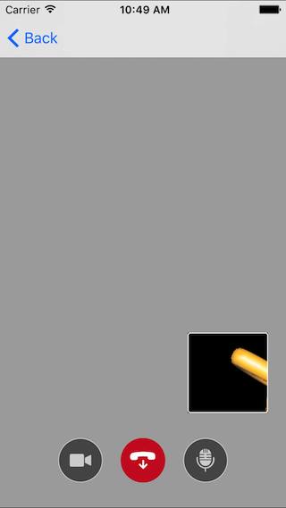
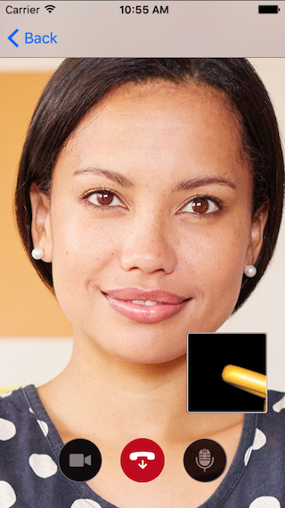
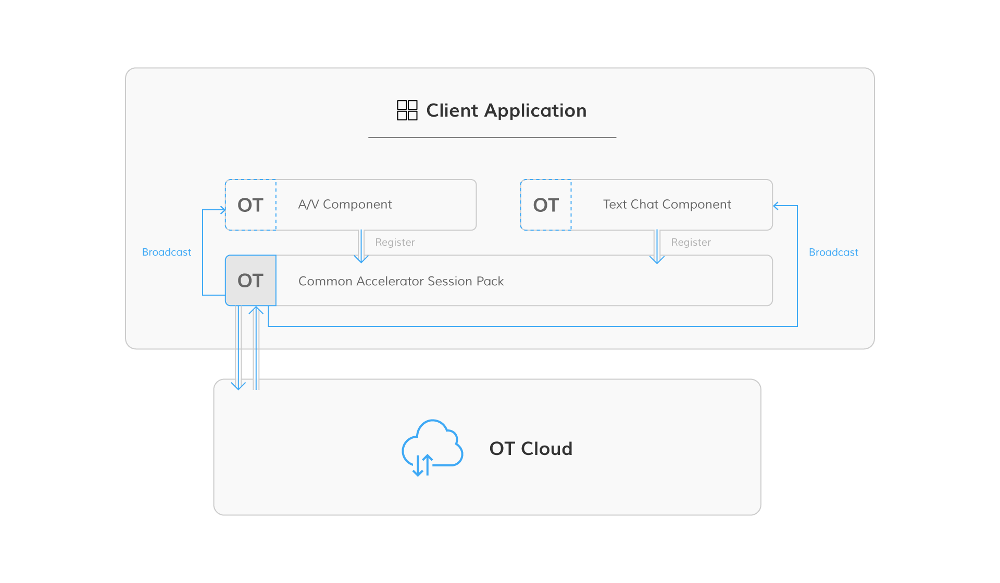

[](https://travis-ci.org/opentok/accelerator-core-ios)
[](https://cocoapods.org/pods/OTAcceleratorCore)
[](https://cocoapods.org/pods/OTAcceleratorCore)
[](https://cocoapods.org/pods/OTAcceleratorCore)
[](http://makeapullrequest.com)

# Accelerator Core iOS <br/>

The Accelerator Core is an easy manner to integrate audio/video communication to any iOS applications via OpenTok platform. Things you can easily do:

- one to one audio/video call
- multiparty audio/video call
- one to one screen sharing
- multiparty screen sharing
- UI components for handling audio/video enable&disable

# Configure, build and run the sample app <br/>

1. Get values for **API Key**, **Session ID**, and **Token**. See [Obtaining OpenTok Credentials](#obtaining-opentok-credentials) for important information.

1. Install CocoaPods as described in [CocoaPods Getting Started](https://guides.cocoapods.org/using/getting-started.html#getting-started).

1. In Terminal, `cd` to your project directory and type `pod install`.

1. Reopen your project in Xcode using the new `*.xcworkspace` file.

1. Replace the following empty strings with the corresponding API Key, Session ID, and Token values:

    ```objc
    - (BOOL)application:(UIApplication *)application didFinishLaunchingWithOptions:(NSDictionary *)launchOptions {
        // Override point for customization after application launch.
        sharedSession = [[OTAcceleratorSession alloc] initWithOpenTokApiKey:@"apikey" sessionId:@"sessionid" token:@"token"];
        return YES;
    }
    ```

1. Use Xcode to build and run the app on an iOS simulator or device.

1. For testing audio/video communication, we include a simple web app to make it easier: [Browser-Demo](https://github.com/opentok/accelerator-core-ios/blob/master/browser-demo.html). Simply open it and replace the corresponding API Key, Session ID, and Token values. Then save and load it to the browser. For multiparty, you can achieve by opening up multiple tabs.

1. You might want to run on other platforms:

[Accelerator Core Javascript](https://github.com/opentok/accelerator-core-js) <br />
[Accelerator Core Android](https://github.com/opentok/accelerator-core-android)

# Sample Codes

Each communicator instance will take the OpenTok session from OTOneToOneCommunicatorDataSource, so this applies to each communicator instance:

- Passing the session
    ```objc
    - (OTAcceleratorSession *)sessionOfOTOneToOneCommunicator:(OTOneToOneCommunicator *)oneToOneCommunicator {
        return <#OTAcceleratorSession#>;
    }
    ```

- One-to-One

    ```objc
    self.communicator = [[OTOneToOneCommunicator alloc] init];
    self.communicator.dataSource = self;
    [self.communicator connectWithHandler:^(OTCommunicationSignal signal, NSError *error) {
        if (signal == OTPublisherCreated && !error) {
            weakSelf.communicator.publisherView.frame = CGRectMake(0, 0, 100, 100);
            [self.publisherView addSubview:weakSelf.communicator.publisherView];
        }
        else if (signal == OTSubscriberReady && !error) {
            weakSelf.communicator.subscriberView.frame = CGRectMake(0, 0, 100, 100);
            [self.subscriberView addSubview:weakSelf.communicator.subscriberView];
        }
    }];
    ```

- Multiparty

    ```objc
    self.communicator = [[OTMultiPartyCommunicator alloc] init];
    self.communicator.dataSource = self;
    [self.communicator connectWithHandler:^(OTCommunicationSignal signal, OTMultiPartyRemote *subscriber, NSError *error) {
        if (signal == OTPublisherCreated && !error) {
            weakSelf.communicator.publisherView.frame = CGRectMake(0, 0, 100, 100);
            [self.publisherView addSubview:weakSelf.communicator.publisherView];
        }
        else if (signal == OTSubscriberReady && !error) {
            subscriber.subscriberView.frame = <#your desired frame for this remote subscriberview#>;
            // your logic to handle multiple remote subscriberview(s)
        }
    }];
    ```

- Screen Sharing

    Use `- (instancetype)initWithView:` or `- (instancetype)initWithView:name:` like so
    ```objc
    self.screenSharer = [[OTOneToOneCommunicator alloc] initWithView:[UIApplication sharedApplication].keyWindow.rootViewController.view];
    ```
    or 
    ```objc
    self.screenSharer = [[OTMultiPartyCommunicator alloc] initWithView:[UIApplication sharedApplication].keyWindow.rootViewController.view];
    ```
    
- Pre-defined UI

    Enable audio&video control
    ```objc
    self.communicator.publisherView.controlView.isVerticalAlignment = YES;
    self.communicator.publisherView.controlView.frame = CGRectMake(10, 10, CGRectGetWidth(self.publisherView.frame) * 0.1, CGRectGetHeight(self.publisherView.frame) * 0.3);
    ```

    Handle video enable/disable control
    ```objc
    // default
    // enable handleAudioVideo property, the publisherView will be covered by a silhouette automatically.
    self.communicator.publisherView.handleAudioVideo = YES; 

    // disable handleAudioVideo property, the publisherView will do nothing for enabling/disabling publishVideo.
    self.communicator.publisherView.handleAudioVideo = NO; 
    ```

# Ready-in-Use components

- One-to-One communication




```objc
OTOneToOneCommunicationController *vc = [OTOneToOneCommunicationController oneToOneCommunicationControllerWithSession:<#OTAcceleratorSession#>];
[self.navigationController pushViewController:vc animated:YES];
```

# Sample Apps that uses the Core

The following sample apps use `Accelerator Core`:

- [OpenTok One-to-One Communication Sample App](https://github.com/opentok/one-to-one-sample-apps) 
- [Accelerator Sample App](https://github.com/opentok/accelerator-sample-apps-ios)


#### Obtaining OpenTok Credentials

To use OpenTok's framework you need a Session ID, Token, and API Key you can get these values at the [OpenTok Developer Dashboard](https://dashboard.tokbox.com/) . For production deployment, you must generate the Session ID and Token values using one of the [OpenTok Server SDKs](https://tokbox.com/developer/sdks/server/).

# Accelerator Core as a dependency <br/>
The Accelerator Core is required whenever you use any of the OpenTok accelerators. The Accelerator Core is a common layer that includes the audio-video communication logic contained in all [OpenTok One-to-One Communication Sample Apps](https://github.com/opentok/one-to-one-sample-apps), and permits all accelerators and samples to share the same OpenTok session. The accelerator packs and sample app access the OpenTok session through the Common Accelerator Session Pack layer, which allows them to share a single OpenTok session:



On the Android and iOS mobile platforms, when you try to set a listener (Android) or delegate (iOS), it is not normally possible to set multiple listeners or delegates for the same event. For example, on these mobile platforms you can only set one OpenTok signal listener. The Common Accelerator Session Pack, however, allows you to set up several listeners for the same event. 
